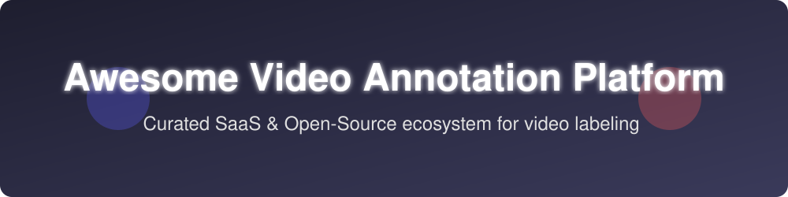

  

# 📹 Awesome Video Annotation Platform

  
  
  

## 🌟 Top Video Annotation Platforms Ecosystem
**Curated List of SaaS Products & Open-Source GitHub Projects**
*Focused on Video Object Tracking, Frame-Level Labeling, Segmentation, Keypoints, AI-Assisted Annotation & Dataset Quality Workflows*
**Last updated: August 2026**

This repository tracks notable **SaaS platforms** and **open-source projects** for **Video Annotation**. These tools enable teams to label video data for computer vision — including bounding boxes, polygons, masks, keypoints, object tracking across frames, interpolation, and quality assurance — to train detection, tracking, and action-recognition models.

**Examples** include SuperAnnotate, Encord, V7 Labs, Dataloop, Labelbox, Kili Technology, CVAT, Supervisely, Deepen AI, and Scale AI (the category leaders).

**Open-source emphasis**: This section is heavily expanded with every major active project for self-hosted video and image annotation, multimodal labeling, and computer-vision dataset tools — ideal for ML teams, researchers, and organizations that need data sovereignty and zero platform licensing cost.

Contributions welcome! Open a PR to add/update entries. Keep descriptions factual and link to official sites.

## 📋 Table of Contents
- [SaaS/Hosted Platforms](#saas-products)
- [Open-Source GitHub Projects](#open-source-github-projects)
- [How to Contribute](#how-to-contribute)
- [Disclaimer](#disclaimer)

## 🏢 SaaS/Hosted Platforms

| Platform | Description | Pricing | Free Tier Limit | Company Size (Valuation/Funding) |
|----------|-------------|---------|-----------------|----------------------------------|
| **[Scale AI](https://scale.com/)** | Enterprise data platform combining software with managed annotation workforces, supporting video, images, 3D, and large-scale labeling programs. | Pay-As-You-Go per unit | First 1,000 labeling units, 10,000 images | ~$13.8B Valuation |
| **[Labelbox](https://labelbox.com/)** | Mature enterprise labeling platform supporting video, images, text, and more, with strong MLOps integrations and model-assisted workflows. | $0.10 per LBU | 500 Labelbox Units (LBUs) / month | ~$1B Valuation |
| **[SuperAnnotate](https://www.superannotate.com/)** | Collaborative annotation platform with strong QA workflows, AI-assisted labeling, and support for images, video, text, and multimodal datasets. | Contact Sales for Enterprise Quote | 1,000 compute hours | ~$36M Funding |
| **[Dataloop](https://dataloop.ai/)** | End-to-end data management and annotation platform covering video and other modalities with pipeline and automation capabilities. | Contact Sales for Enterprise Quote | 14-day free trial | ~$33M Funding |
| **[V7 Labs (Darwin)](https://www.v7labs.com/)** | Annotation and dataset platform strong in medical, life-sciences, and complex visual data, with auto-annotation, video tracking, and broad format support. | Contact Sales (Legacy ~ $499/mo) | 1 Workspace, 10 Users, 100 Items | ~$33M Funding |
| **[Encord](https://encord.com/)** | Enterprise platform specialized in high-quality video, medical imaging (DICOM), and multimodal annotation with advanced tracking, consensus, and active-learning features. | Contact Sales for Enterprise Quote | 25,000 images/frames (Active Open Source) | ~$30M Funding |
| **[Kili Technology](https://kili-technology.com/)** | Annotation platform focused on quality, project management, and support for computer-vision and other data types including video. | Contact Sales for Enterprise Quote | 200 assets, 2 team seats | ~$25M Funding |
| **[CVAT (Cloud / Enterprise offerings)](https://www.cvat.ai/)** | Leading computer-vision annotation tool available as open-source, hosted cloud, and enterprise editions with robust video and 3D support. | Contact Sales for Enterprise Quote | 10 tasks, 500 MB storage | Spin-off / Independent |
| **[Supervisely](https://supervisely.com/)** | Computer-vision platform offering annotation, dataset management, and neural-network training tools with video and 3D capabilities. | €199/month (Pro) | 5 GB storage, 10,000 files, 500 Smart Tool requests/day | Bootstrapped / Startup |
| **[Deepen AI](https://www.deepen.ai/)** | Annotation and data platform oriented toward autonomous systems, sensor fusion, and advanced 3D/video labeling workflows. | Contact Sales for Enterprise Quote | 14-day free trial by request | Seed / Startup |

## 💻 Open-Source GitHub Projects
- **[Label Studio](https://github.com/HumanSignal/label-studio)**   
  Flexible open-source multi-modal annotation tool that supports video alongside images, text, audio, and time-series data, with a large community and extensible backends.

- **[CVAT (Computer Vision Annotation Tool)](https://github.com/cvat-ai/cvat)**   
  The leading open-source platform for image, video, and 3D annotation, featuring object tracking, interpolation, AI-assisted labeling, team collaboration, and full self-hosting.

- **[FiftyOne](https://github.com/voxel51/fiftyone)**   
  Dataset visualization, evaluation, and exploration alongside labeling integrations for seamless dataset management.

- **[VoTT (Visual Object Tagging Tool)](https://github.com/microsoft/VoTT)**   
  Open-source Electron app from Microsoft for end-to-end object detection annotation on images and videos.

- **[COCO Annotator](https://github.com/jsbroks/coco-annotator)**   
  Web-based image annotation tool designed for versatility and custom labeling pipelines.

- **[Universal Data Tool](https://github.com/UniversalDataTool/universal-data-tool)**   
  Open-source web/desktop application for annotating images, video, text, audio, and custom data formats defined by extensible schemas.

- **[Diffgram](https://github.com/diffgram/diffgram)**   
  Open-source training-data platform for labeling, workflow, and dataset management across images, video, 3D, and other modalities at scale.

- **[Roboflow Python](https://github.com/roboflow/roboflow-python)**   
  Roboflow open components and community export/import tooling.

- **[Tator](https://github.com/cvisionai/tator)**   
  Open-source video analytics and annotation web platform designed for media annotation, analysis, and collaboration.

- **[DIVE](https://github.com/Kitware/dive)**   
  Open-source media annotation and analysis tools for web and desktop, focused on video and related visual data.

### Additional Strong Open-Source Options
- LabelMe and classic academic annotation tools (still useful for simpler projects).
- Integration of SAM / SAM 2 / other foundation models as auto-label backends inside CVAT or Label Studio.
- Self-hosted workflow engines that orchestrate human-in-the-loop video labeling pipelines.

**Frameworks for building custom systems**: Deploy **CVAT** as the core video annotation engine (self-hosted), use **Label Studio** when multi-modal or LLM-evaluation workflows are also needed, add **Diffgram** or **Tator** for broader training-data operations, and connect model-assisted labeling via open segmentation/tracking models. Store datasets in object storage, version them with DVC or similar, and feed labeled video into training pipelines. Local LLMs or vision models can further accelerate pre-labeling and quality checks.

## 🤝 How to Contribute
1. Fork the repo.
2. Add/edit entries in `README.md` (follow existing format).
3. Include: name, link, 1–2 sentence description, and whether it's SaaS or open-source.
4. Submit PR with a short explanation.

⭐ Star the repo if you find it useful!

## ⚠️ Disclaimer
- This is a **community-curated** list — not exhaustive and not an endorsement.
- Video annotation often involves sensitive or proprietary footage. Self-hosted open-source tools give full data control but require proper access management, backup, and (where applicable) compliance with privacy or industry regulations.
- Annotation quality directly impacts model performance; invest in clear guidelines, inter-annotator agreement checks, and review workflows regardless of the platform chosen.

---
**Made for computer-vision engineers, data-labeling teams, and organizations building high-quality video datasets.**
Let's make video annotation more open, self-hostable, and collaborative.

## 📈 Star History

